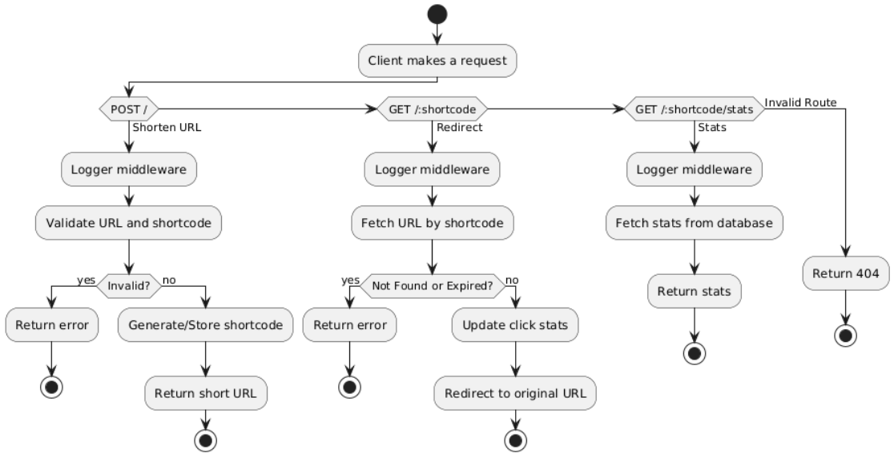

#The URL Shortener is built using a modular and layered architecture that separates responsibilities into distinct parts for better clarity, maintainability, and scalability.
•	server.js – Initializes the Express server, applies middleware, and sets up routing.
•	Routing Layer (routes/urlRouter.js) – Manages API endpoints for creating, redirecting, and retrieving URL stats.
•	Handler Layer (handler/urlHandler.js) – Implements core business logic such as generating shortcodes, validating URLs, redirecting, and tracking analytics.
•	Middleware (middleware/logger.js, logMiddleware.js) – Handles centralized logging to an external evaluation service.
•	Utility Layer (utils/) – Provides reusable helpers like URL validation, shortcode generation, and in-memory storage (Map).
•	Design Principles – Follows modularization, separation of concerns, DRY (Don't Repeat Yourself), and single responsibility principle for maintainable code.
This structure ensures clear logic separation and makes the application easy to extend or refactor.
##Architecture
.
